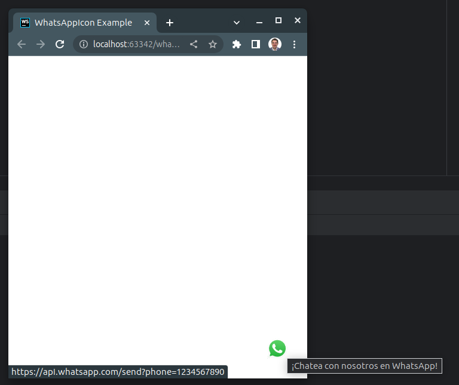

# WhatsApp Icon Web Component

This web component displays a floating WhatsApp icon in the corner of the page. You can set the position, phone number, and a tooltip message that is displayed when you hover over the icon.



## Installation

1. Copy the component code into a JavaScript file in your project (for example, `WhatsAppIcon.js`).
2. Include the JavaScript file in your HTML using the `<script>` tag:

```html
<script src="path/to/WhatsAppIcon.js" type="module"></script>
```

You can add the component to your HTML using the <whatsapp-icon> tag. Here's an example:
```html
<whatsapp-icon position="bottom-right" phone="1234567890" title="Chat with us on WhatsApp!"></whatsapp-icon>
```

## Attributes

    position: The position of the icon on the page. It can be "bottom-right", "bottom-left", "top-right", or "top-left". Default is "bottom-right".
    phone: The phone number for the WhatsApp link. Be sure to include the country code.
    title: An optional message that is displayed as a tooltip when hovering over the icon.

## Customization

You can customize the style and content of the component by editing the JavaScript file. For example, you can change the size of the icon or use a different SVG.

## License

This component is open source and can be used and modified according to your needs.